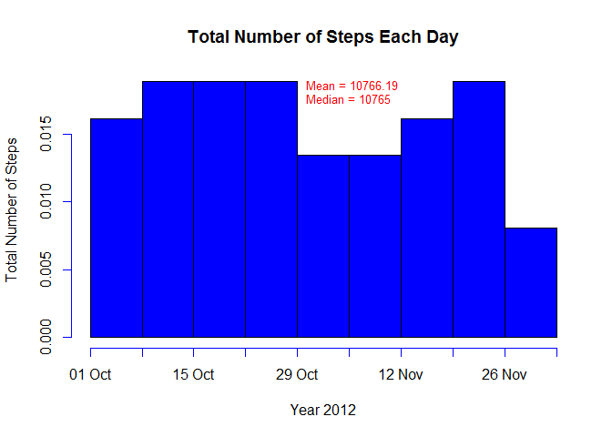
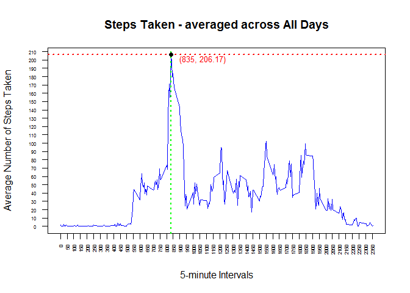
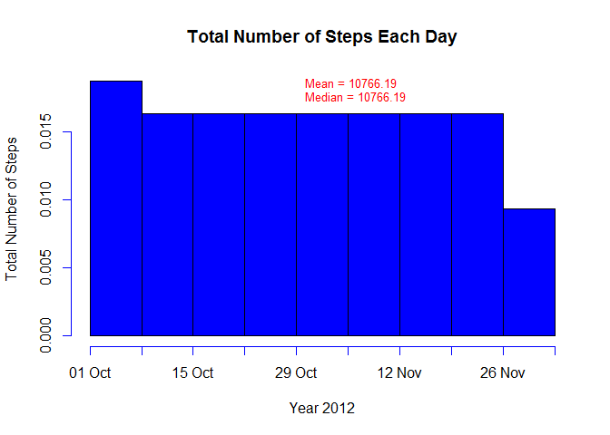
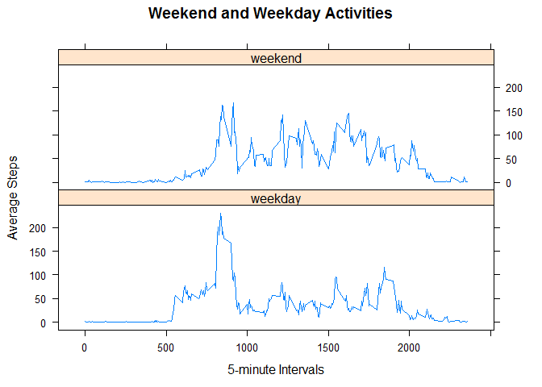

# Reproducible Research: Peer Assessment 1


## Loading and preprocessing the data


```r
library(lattice)
library(timeDate)
dataset<-read.csv("activity.csv",header=TRUE,sep = ",", stringsAsFactors = FALSE)
dim(dataset)
```

```
## [1] 17568     3
```

```r
head(dataset)
```

```
##   steps       date interval
## 1    NA 2012-10-01        0
## 2    NA 2012-10-01        5
## 3    NA 2012-10-01       10
## 4    NA 2012-10-01       15
## 5    NA 2012-10-01       20
## 6    NA 2012-10-01       25
```

```r
summary(dataset)
```

```
##      steps            date              interval     
##  Min.   :  0.00   Length:17568       Min.   :   0.0  
##  1st Qu.:  0.00   Class :character   1st Qu.: 588.8  
##  Median :  0.00   Mode  :character   Median :1177.5  
##  Mean   : 37.38                      Mean   :1177.5  
##  3rd Qu.: 12.00                      3rd Qu.:1766.2  
##  Max.   :806.00                      Max.   :2355.0  
##  NA's   :2304
```

## What is mean total number of steps taken per day?

```r
#Removing <NA> readings
dataC<-na.omit(dataset) 
dim(dataC)
```

```
## [1] 15264     3
```

```r
stepsD<-aggregate(dataC$steps, by=list(dataC$date), FUN=mean)
names(stepsD) <- c("Date", "MeanSteps")

#Calculating the total number of steps taken per day
stepsT<-aggregate(dataC$steps, by=list(dataC$date), FUN=sum,  na.rm=TRUE)
names(stepsT) <- c("Date", "totSteps")

#Histogram : Total number of steps taken each day
plot.new()
hist(as.Date(stepsT$Date),"weeks", format = "%d %b", col="blue", freq=FALSE, 
     ylab = "Total Number of Steps", xlab="Year 2012" ,main="Total Number of Steps Each Day" )

#Report the mean and median of the total number of steps taken per day
stmn<-round(mean(stepsT$totSteps),2)
stmd<-median(stepsT$totSteps)
par(new=T)
text(x=as.Date("2012-10-29"), y=0.018, labels=paste("Mean = ", stmn, "\nMedian = ", 
                     stmd, sep = ''), cex=.8, col = "red",pos = 4) 
```

 

## What is the average daily activity pattern?

```r
#Average Daily
dataT<-aggregate(dataC$steps, by=list(dataC$interval), FUN=mean ,na.rm=TRUE)
names(dataT) <- c("interval", "AvgSteps")
maxT<-dataT$interval[dataT$AvgSteps==max(dataT$AvgSteps)]
maxA<-max(dataT$AvgSteps)
plot.new()
plot(dataT$interval, dataT$AvgSteps,  type="l", yaxt="n",xaxt="n",col="blue", xlab="5-minute Intervals", 
     ylab ="Average Number of Steps Taken", main = "Steps Taken - averaged across All Days" )
axis(1, at = seq(0, dataT$interval[length(dataT$interval)], by = 50), las=2, cex.axis = 0.5, cex.lab = 0.5)
axis(2, at = seq(0, maxA+10, by = 10), las=2, cex.axis = 0.5, cex.lab = 0.5)
abline(a=maxA, b=0, h=maxA,lwd=2,lty="dotted", col="red")
abline(a=maxT, b=1, v=maxT,lwd=2,lty="dotted",  col="green")

points(maxT, y = maxA, type = "p", pch=19)
par(new=T)
text(x=maxT, y=maxA-5, labels=paste(" (", maxT, ", ", round(maxA,2), ")", 
                                           sep = ''), cex=.8, col = "red",pos = 4) 
```

 

## Imputing missing values

```r
#There are 2304 rows with NA in only variable "steps"
#Original Dataset
sum(is.na(dataset))
```

```
## [1] 2304
```

```r
#[1] 2304
sum(is.na(dataset$steps))
```

```
## [1] 2304
```

```r
#[1] 2304

#Strategy used for filling in all the missing values in the dataset is to use the mean for that 5-minute interval

#Creating a new dataset that is equal to the original dataset but with the missing data filled in.

dataset2<-dataset
rownos<-dataset2[is.na(dataset2$steps),1]
length(rownos)
```

```
## [1] 2304
```

```r
#[1] 2304

newdt<-merge(dataset2, dataT, by="interval", all=TRUE)
newdt$steps<-ifelse(is.na(newdt$steps),newdt$AvgSteps,newdt$steps)


#Histogram:  Total number of steps taken each day 
# and Calculating and report the mean and median total number of steps taken per day. 
nstepsT<-aggregate(newdt$steps, by=list(newdt$date), FUN=sum,  na.rm=TRUE)
names(nstepsT) <- c("Date", "totSteps")


plot.new()
hist(as.Date(nstepsT$Date),"weeks", format = "%d %b", col="blue", freq=FALSE, 
     ylab = "Total Number of Steps", xlab="Year 2012" ,main="Total Number of Steps Each Day" )


nstmn<-round(mean(nstepsT$totSteps),2)
nstmd<-round(median(nstepsT$totSteps),2)

par(new=T)
text(x=as.Date("2012-10-29"), y=0.018, labels=paste("Mean = ", nstmn, "\nMedian = ", 
                                                    nstmd, sep = ''), cex=.8, col = "red",pos = 4) 
```

 

```r
# Changing the new average NOT REQUIRED BECAUSE AVERAGE WILL NOT CHANGE

# Create a new factor variable in the dataset with two levels - "weekday" and "weekend" 
# indicating whether a given date is a weekday or weekend day.

newdt$wday <- ifelse(isWeekday(newdt$date),"weekday", "weekend")
newdt$wday <-factor(newdt$wday)

wdataT<-aggregate(newdt$steps, by=list(newdt$interval,newdt$wday), FUN=mean ,na.rm=TRUE)
names(wdataT) <- c("interval", "wday", "AvgSteps")

xyplot(AvgSteps~interval|wday, data = wdataT,   layout=c(1,2), type = "l", 
       xlab="5-minute Intervals", ylab="Average Steps", main="Weekend and Weekday Activities")
```

 

## Are there differences in activity patterns between weekdays and weekends?
We can make few observations based on the readings below:

```r
## MEAN ACTIVITY
round(median(wdataT$AvgSteps[wdataT$wday=="weekday"]),0) # During the weekday
```

```
## [1] 26
```

```r
round(median(wdataT$AvgSteps[wdataT$wday=="weekend"]),0) # During the weekend
```

```
## [1] 32
```
* Mean average activity during the weekend (32) is larger than that of weekdays(26), indicating that there is more physical activities happening during the weeends and relatively lesser activity during the week day. We can say that the sample is a desk-worker and enjoys a activities during the weekends.

```r
## MAX AVERAGE ACTIVITY
max(wdataT$AvgSteps[wdataT$wday=="weekday"])  # During the weekday
```

```
## [1] 230.3782
```

```r
max(wdataT$AvgSteps[wdataT$wday=="weekend"])  # During the weekend
```

```
## [1] 166.6392
```
* But the maximum activity or higher intensity of activity is observed during the weekday(230) in comparison to weekend(167), indicating that during the weekdays at a particular time of the day there is a lot of activity and since weekday average activity is lower than the weekend activity we can say that the sample has a bout while going to office or reaching kids to the school.

```r
## MAX AVERAGE ACTIVITY TIME-SLOT
wdataT$interval[wdataT$AvgSteps==max(wdataT$AvgSteps[wdataT$wday=="weekday"])] # for weekday
```

```
## [1] 835
```

```r
wdataT$interval[wdataT$AvgSteps==max(wdataT$AvgSteps[wdataT$wday=="weekend"])] # for weekend
```

```
## [1] 915
```
* Next we observe that the peak of activity takes place a bit late(915 time slot) during the weekends, compared to (835 time-slot) during the weekdays, indicating that the sample is resting longer in the early time-slots of the day during the weekend. We can say that the sample is sleeping or relaxing longer in the morning during the weekends.

```r
## STANDARD DEVIATION
round(sd(wdataT$AvgSteps[wdataT$wday=="weekday"]),0)   # During the weekday
```

```
## [1] 42
```

```r
round(sd(wdataT$AvgSteps[wdataT$wday=="weekend"]),0)   # During the weekend
```

```
## [1] 43
```
* Lastly, approximate same standard deviation for both weekend and weekday average activities indicates that the pattern of activity is not very different between weekday and weekend 
